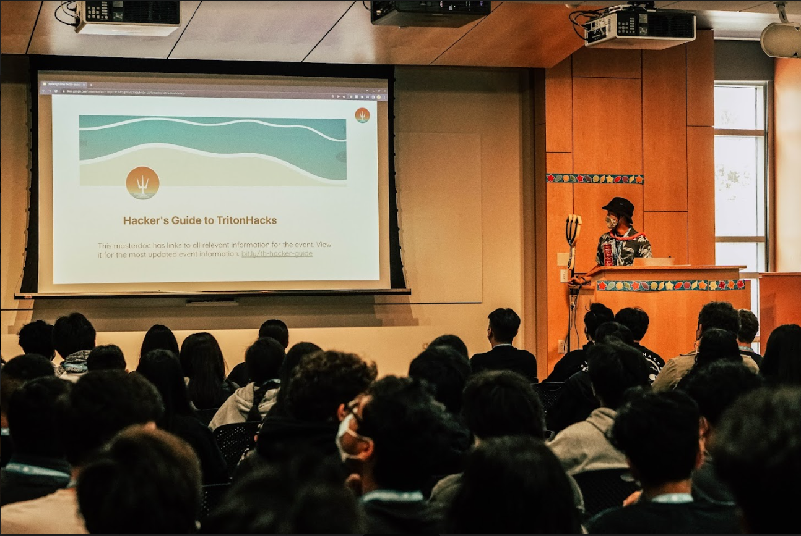
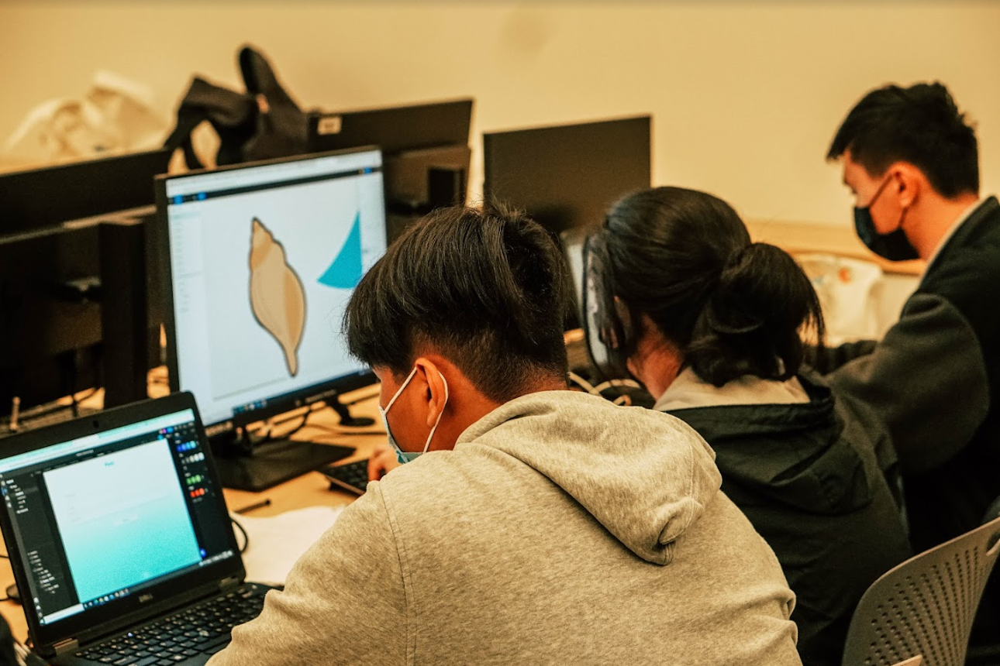
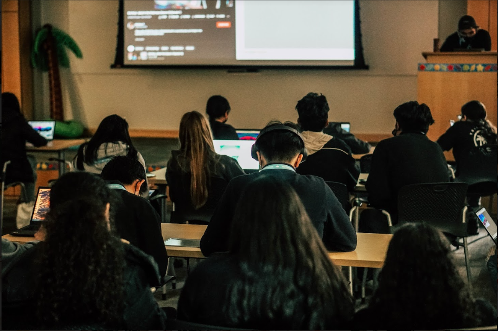
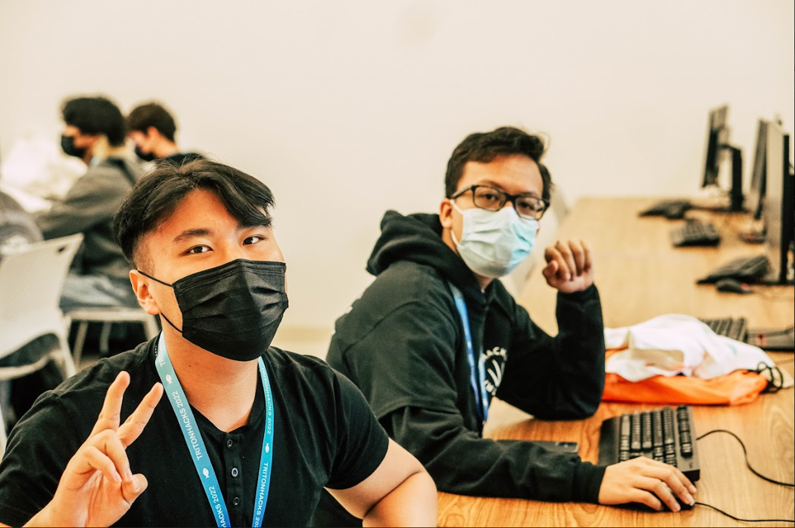
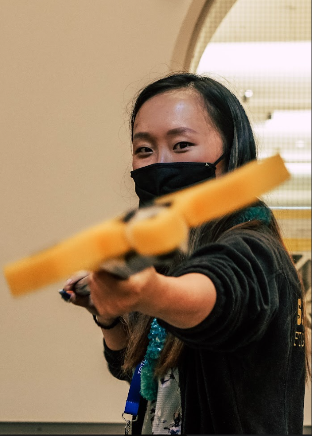
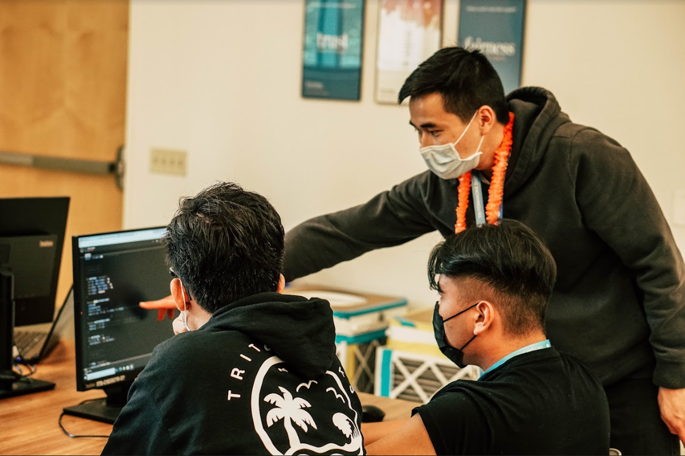
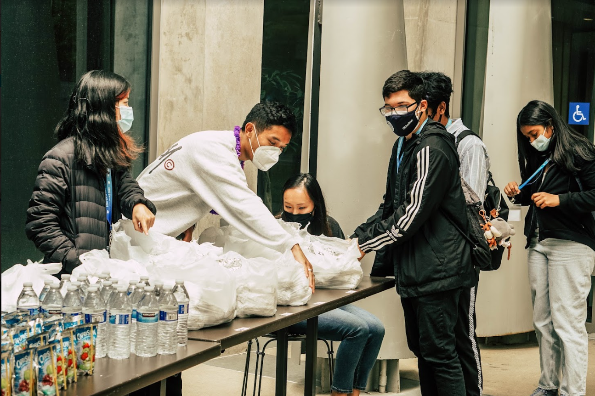
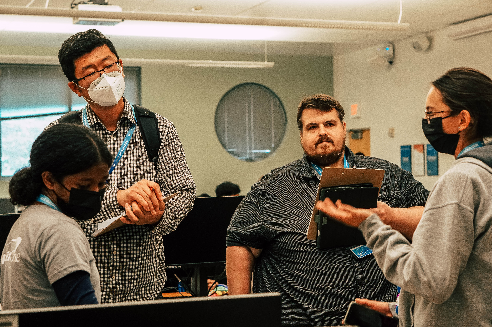
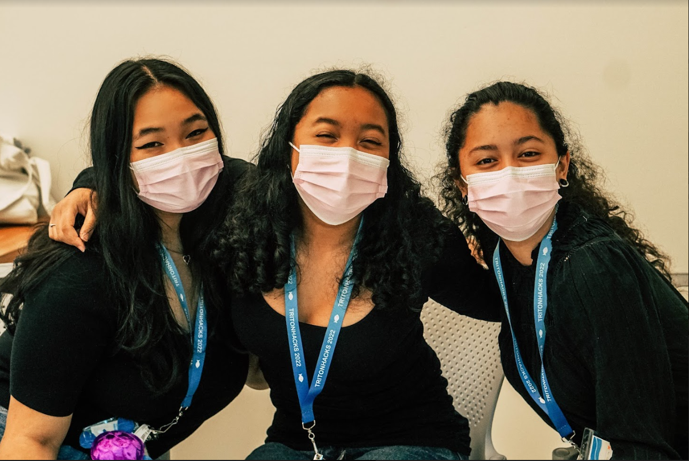

# The GitHub Grant Fund

# TritonHacks 2022
**May 21-22, 2022**

**CS foreach at UC San Diego**

**San Diego, CA, USA**  

## Event Summary

TritonHacks was a two-day, ocean-themed hackathon aiming to provide greater access to CS education for disadvantaged local communities. In addition to the usual offerings of workshops and mentorship during the hackathon, we also offered starter kits which were made specifically for the theme of the event. As the big theme of the weekend was working with local communities, our hackathon was hosted at UC San Diego, fed by local restaurants, and merchandise was sourced from local companies.

We hosted 3 technical workshops: intro to web dev, image classification, data visualization; a soft skills workshop: professional development/presentation; and finally a social event: a painting with Bob Ross mini-event.

GitHub was part of the submission process for our hackathon and MLH helped us provide some GitHub stickers :) 

## Event Metrics 
> Feel free to include any other metrics that you think may be important or applicable. 

| Attendees | First Time Hackers |                                                     Projects |
| --------: | -----------------: | -----------------------------------------------------------: |
|        69 |                 63 | 23 [TritonHacks-22-Devpost](https://tritonhacks22.devpost.com/project-gallery) |

## Tech Impact / Diversity 

### Tell us about your hacker demographics
As the objective of our hackathon was to reach out to San Diegan high school students of underrepresented backgrounds, we kept track of the hackers that attended. We had 47 males and 22 females, roughly 31.8% of attendees were female.

### What race & ethnicities did your hackers identify as?
| Native American /   Alaskan Native | Black /   African American | Hispanic /   Latinx |       Asian |      White |
| ------------------------------------: | ----------------------------: | ---------------------: | ----------: | ---------: |
|                                 1+1=2 |                       1+1+1=3 |             6+3+2+1=12 | 43+2+2+1=48 | 4+3+2+1=10 |

### Where were your hackers from?
| Asia Pacific | North America | Europe / UK | Other |
| -----------: | ------------: | ----------: | ----: |
|            0 |            69 |           0 |     0 |

## Impact of GitHub Grant

Using the GitHub Grant funds, we were able to purchase the prizes for the attendees. Since the prizes were the incentives for the hackers to compete for one category over another, being able to afford nicer prizes created a greater incentive for more hackers to apply!

## Top Projects

While all the projects can be found on our [devpost gallery](https://tritonhacks22.devpost.com/project-gallery) here's a little about the grand prize winners! Each of the projects are hosted on GitHub repos for everybody to see how the project was built at the end. Some teams used GitHub for collaboration during this event.

[Ocean Juice](https://devpost.com/software/sound-sensor-arduino-with-web-app): "Noise is amplified in the ocean because sound travels faster in the water. Because of this, sea creatures are fatally affected by noise. Noises as simple as a propeller from a ship to a whale is like firing a 12 gauged shot gun next to a human's ear." To tackle this issue, the team took an arduino to sense noise pollution and transferred the data to a web app which visualized the data in the form of a shaking turtle.

[Coral Guesser](https://devpost.com/software/coral-guesser): Illegal fishing is a problem which damages the ecosystem of sensitive environments across the globe. "For part 1 of our project, we utilized machine learning to whether or not is fishing illegally, when given some data. We also made a fun game where the user would have to guess which beach they were located. After the user made a guess, they would learn about the pollution status of the beach, thus giving the user a deep knowledge on what's going on in the world with respect to ocean pollution."

[Aquatic Ecosystem Simulation](https://devpost.com/software/aquatic-ecosystem-simulation): "The observation of the natural environment and seeing the introduction of species by humans and bringing imbalance to a balanced ecosystem. We coded a fish simulation where there are three types of fish: Goldfish, Tropical Fish, and Sharks. The simulation initially starts with 20 goldfish, 5 tropical fish, and 1 shark. As long as there are two fish of the same type, new fish are born. When the tropical fish collides with a goldfish, the tropical fish "eats" the goldfish and the goldfish disappears. When the shark collides with a tropical fish, the shark will eat that fish. The background of the simulation is a coral reef."

## Event Photos

All of the photos can be found on our [public album](https://drive.google.com/drive/folders/1rWoChMY2Ug0_najx8bfldixXFjKb0A0u) but here's a few highlights!

|  |
| :---------------------------: |
|     **Opening Ceremony**      |

|  |
| :---------------------------: |
|   **Hackers hard at work!**   |

|  |
| :---------------------------: |
|       **Workshopping**        |

|  |
| :-------------------------: |
|         **Posing**          |

|               |
| :--------------------------------------------: |
| **Volunteer coordinator poking at the camera** |

|            |
| :---------------------------------: |
| **Tutor doing what tutors do best** |

|  |
| :-------------------------: |
|     **Time to refuel!**     |

|  |
| :-----------------------: |
|        **Judging**        |

|  |
| :-----------------------: |
|    **Girls that code**    |

## What’s Next?

Overall, the event ran smoothly and safely. The hackers had a grand time and learned a great deal! The overwhelming majority were first time hackers with the few returning hackers being hackers that were in TritonHacks 2021, our first hackathon! Volunteers had plenty of work to do during the event and we had more than enough food for hackers to take home extras if they needed it. Judges that were able to stick around announced how impressive the projects were to them.

While we don't have the exact date of the future hackathon yet, we anticipate hosting the hackathon May 20-21, 2023.

[tritonhacks.org](https://www.tritonhacks.org/) :fish::fish::fish: [TritonHacks Instagram](https://www.instagram.com/ucsdtritonhacks/) :fish::fish::fish:  [TritonHacks Facebook](https://www.facebook.com/triton.hacks)
[csforeach.org](https://csforeach.ucsd.edu/) :fish::fish::fish: [CS foreach Twitter](https://twitter.com/cforeach) :fish::fish::fish:  [CS foreach Facebook](https://www.facebook.com/csforeach)

